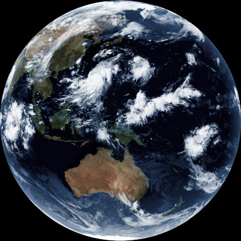
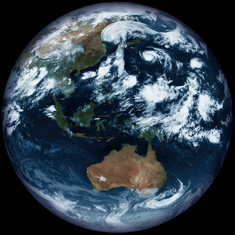
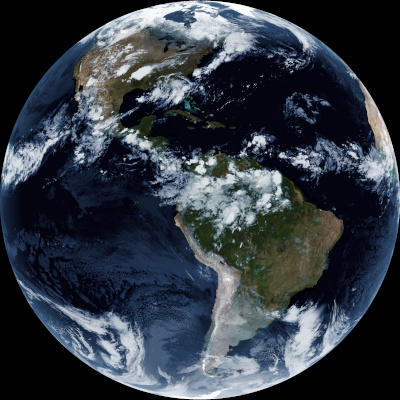
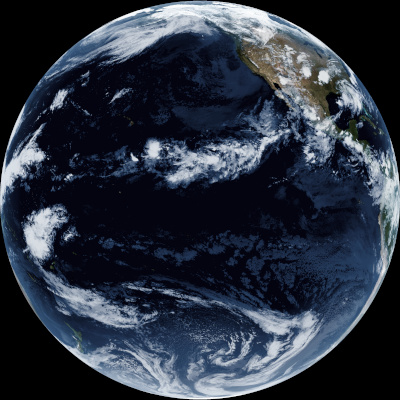

# Sanchez


[](https://coveralls.io/github/nullpainter/sanchez?branch=master)
[]()


<a href="Documentation/Himawari-8.jpg"></a>
<a href="Documentation/GK-2A.jpg"></a>
<a href="Documentation/GOES-16.JPG"></a>
<a href="Documentation/GOES-17.jpg"></a>

**Sanchez brings your dull IR satellite images to life.**

Utilising a full-colour, high resolution, static ~~ándale~~ underlay image, combining it with a single greyscale IR satellite image, an optional mask and overlay and some zhushing, Sanchez will create beautiful images to be proud of.

This could be considered cheating, but this is the approach that NASA used to utilise for older weather satellites. If it's good enough for NASA, it should be good enough for you.

If you provide a mask image, you can compensate for discrepancies in scale or distortion between the satellite image and the full-colour image. Sanchez also provides options for batch conversion, colour tinting, an overlay for text or other imagery, brightness and contrast adjustment.

_¡Arriba, Arriba! ¡Ándale, Ándale!_

## Sample images

Sample images can be [found here](https://github.com/nullpainter/sanchez/wiki/Sample-images). If you have interesting images to contribute, [let me know](https://github.com/nullpainter/sanchez/issues/new?assignees=nullpainter&labels=&template=sample-image.md&title=)!

## Download

Releases are available for Raspberry Pi, Linux, Mac OS X and Windows. [Head on over](https://github.com/nullpainter/sanchez/releases) and pick your poison!

For Raspberry Pi, pick the ARM build.

## Image resources

Sample underlays, masks and IR images for Himawari-8, GK-2A, GOES-16 and GOES-17 are in the [Resources](Sanchez/Resources) folder. Each satellite has an underlay which matches the pixel dimensions of the IR image, and an additional high-resolution underlay. It is recommended to use the high-resolution underlay unless you care about pixel-perfect IR.

## Usage

All images are expected to be the same aspect ratio. If images are different sizes - for example, when using the high-resolution underlays - source images will be scaled up.

```
  -u, --underlay      Required. Path to full-colour underlay image

  -s, --source        Required. Path to IR satellite image(s)

  -m, --mask          Optional path to mask image

  -O, --overlay       Optional path to overlay image

  -o, --output        Required. Path to output file or folder

  -t, --tint          (Default: 5ebfff) Tint to apply to satellite image

  -b, --brightness    (Default: 1.2) Brightness adjustment

  -S, --saturation    (Default: 0.7) Saturation adjustment

  -q, --quiet         (Default: false) Don't provide any console output

  -f, --force         (Default: false) Force overwrite existing output file

  -T, --threads       (Default: CPU core count) Number of threads to use for batch processing

  --help              Display this help screen.

  --version           Display version information.

```

### Sample usage

#### Batch

```
./Sanchez -s "c:\images\Himawari8\**\*-IR*.jpg" -m Resources\Mask.jpg -u Resources\Himawari-8\Underlay-Hirez.jpg` -o Output.jpg
```

#### Single image

```
./Sanchez -s "c:\images\Himawari8\**\Himawari8_FD_VS_20200727T005100Z.jpg" -m Resources\Mask.jpg -u Resources\Himawari-8\Underlay-Hirez.jpg` -o Output.jpg -t #0096FA
```

## Tint formats

Sanchez supports any of the following tint formats, with or without the leading `#`:

- `#xxx`
- `#xxxxxx`
- `#xxxxxxxx`

## Batch file conversion

Sanchez supports converting single or batch satellite files. If converting a batch, the output argument is assumed to be a folder and is created if needed. Original file names are preserved, with a `-fc` suffix.

### Sample batch patterns

Sanchez supports glob and directory patterns for the `--source` argument.

Examples are:

- `images/`
- `images/*.*`
- `images/*.jpg`
- `images/**/*.*`
- `images/2020-*/*IR*.jpg`

Note that patterns with wildcards should be quoted with `""` on shells that do wildcard expansion (i.e., everything other than Windows).

## Logging

Detailed logs are written to disk in the `logs` directory relative to the directory where Sanchez is called from.

## Creating underlay images

NASA's collection of [Blue Marble](https://visibleearth.nasa.gov/collection/1484/blue-marble) images is an excellent source of high resolution underlay images.

In order to projection map images, the [Cartophy](https://scitools.org.uk/cartopy/docs/latest/) Python library can be used. Sample code will be added to the repository soon.

This is the approach, software and source images used for the sample underlay images in the [Resources](Sanchez/Resources) folder.
