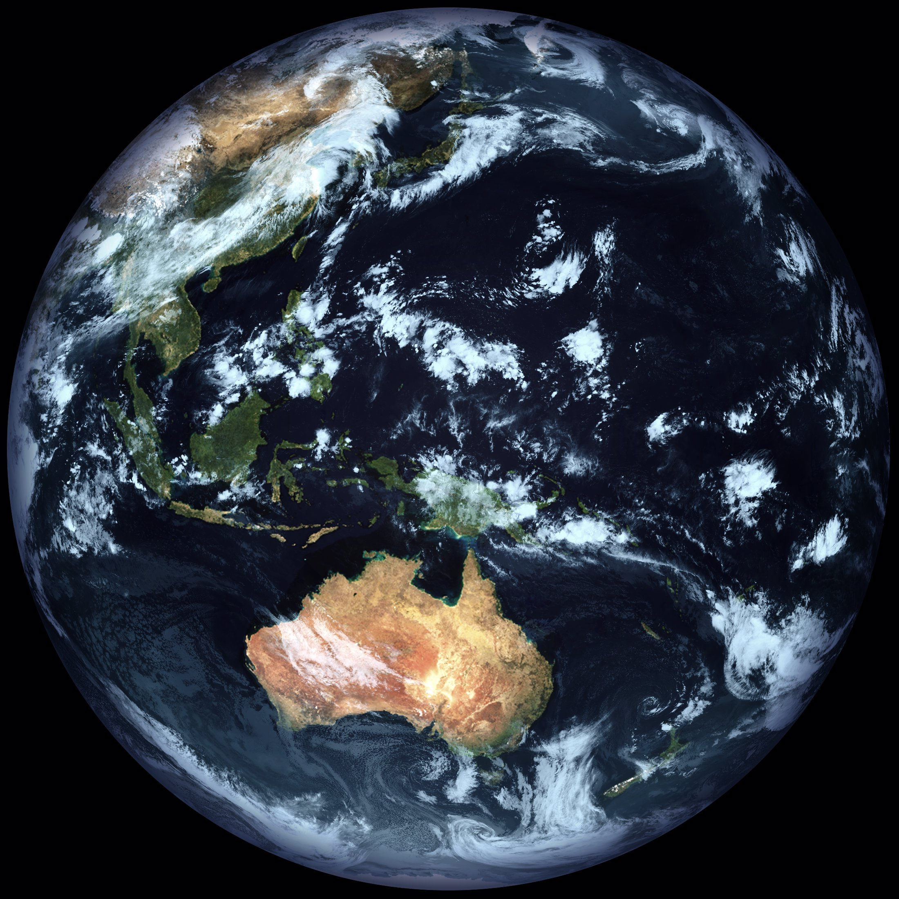

# Sanchez 
 

 

**Sanchez brings your dull IR satellite images to life.**

Utilising a full-colour static ~~ándale~~ underlay image, combining it with a single greyscale IR satellite image, an optional mask and some zhushing, Sanchez will create beautiful images to be proud of.

This could be considered cheating, but this is the approach that NASA used to utilise for older weather satellites. If it's good enough for NASA, it should be good enough for you.

If you provide a mask image, you can both overlay text or compensate for discrepancies in scale or distortion between the satellite image and the full-colour image. Sanchez also provides options for colour tinting, brightness and contrast adjustment.

*¡Arriba, Arriba! ¡Ándale, Ándale!*

## Image resources
Sample underlays, masks and IR images for Himawari-8 are in the [Resources](Sanchez/Resources) folder. GK-2A images are coming soon.

## Usage

```
  -u, --underlay      Required. Path to full-colour underlay image

  -s, --source        Required. Path to satellite image being composed

  -m, --mask          Optional path to mask image

  -o, --output        Required. Path to output file

  -t, --tint          (Default: 5ebfff) Hex triplet tint to apply to satellite image

  -b, --brightness    (Default: 1.2) Brightness adjustment

  -S, --saturation    (Default: 0.7) Saturation adjustment

  --help              Display this help screen.

  --version           Display version information.

```

Example, if running from source:

```
dotnet run -- -s Resources\Himawari-8\Himawari8_B_FD_IR_20200719T005100Z.jpg -m Resources\Mask.jpg  -u Resources\Himawari-8\Underlay.jpg` -o Output.jpg
```

It is assumed that all input images are the same size.

## Creating underlay images
NASA's collection of [Blue Marble](https://visibleearth.nasa.gov/collection/1484/blue-marble) images is an excellent source of high resolution underlay images.

Websites such as [Map To Globe](https://www.maptoglobe.com/) can be used to map the underlay to a globe. Images produced by both GK-2A and Himawari-8 are slightly warped so don't fully map to texture-mapped globes. In order to correct for this, Photoshop's lens correction filter can be used.

This is the approach used for the sample underlay images in the [Resources](Sanchez/Resources) folder.

