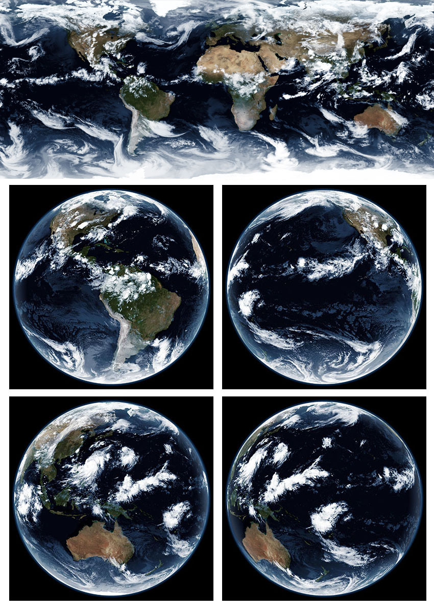

# Sanchez


[](https://coveralls.io/github/nullpainter/sanchez?branch=master)
[]()


</a>

**Sanchez brings your dull IR satellite images to life.**

Utilising a full-colour, high resolution, static ~~ándale~~ underlay image, combining it with a single greyscale IR satellite image, and some serious maths, Sanchez will create beautiful images to be proud of.

This could be considered cheating, but this is the approach that NASA used to utilise for older weather satellites. If it's good enough for NASA, it should be good enough for you.

Sanchez can bring colour to full-disc images, but it can also reproject and blend images from multiple satellites - either creating a flat projected image, or by creating a virtual satellite image at a given longitude.

Full documentation with examples of all options is available in the [wiki](https://github.com/nullpainter/sanchez/wiki). 


_¡Arriba, Arriba! ¡Ándale, Ándale!_

## Sample images

Sample images can be [found here](https://github.com/nullpainter/sanchez/wiki/Sample-images). If you have interesting images to contribute, [let me know](https://github.com/nullpainter/sanchez/issues/new?assignees=nullpainter&labels=&template=sample-image.md&title=)!

## Download

Releases are available for Raspberry Pi, Linux, Mac OS X and Windows. [Head on over](https://github.com/nullpainter/sanchez/releases) and pick your poison!

For Raspberry Pi, pick the ARM build.

## Usage

### Common arguments

```
  -b, --brightness        (Default: 1) Brightness adjustment

  -d, --tolerance         (Default: 30) Time tolerance in minutes in identifying suitable satellite images when combining

  -D, --definitions       Path to custom satellite definitions

  -i, --interpolation     (Default: B) Interpolation type. Valid values are N (nearest neighbour), B (bilinear)

  -f, --force             (Default: false) Force overwrite existing output file

  -L, --noadjustlevels    (Default: false) Don't perform histogram equalisation on satellite imagery

  -o, --output            Required. Path to output file or folder

  -p, --parallel          (Default: 1) Number of files to process in parallel

  -q, --quiet             (Default: false) Don't perform console output

  -r, --resolution        (Default: 4) Output spatial resolution in km; valid values are 2 or 4

  -s, --source            Required. Path to IR satellite image(s)

  -S, --saturation        (Default: 0.7) Saturation adjustment

  -t, --tint              (Default: 1b3f66) Tint to apply to satellite image

  -T, --timestamp         Target timestamp in UTC if combining multiple files; e.g. 2020-12-20T23:00:30

  -u, --underlay          Path to custom full-colour underlay image

  -U, --nounderlay        If no underlay should be rendered

  -v, --verbose           (Default: false) Verbose console output

  --help                  Display this help screen.

  --version               Display version information.
```

### Geostationary (full disc) compositing

```
  -l, --longitude         Target longitude for geostationary satellite projection

  -h, --haze              (Default: 0.2) Amount of haze to apply to image; valid values are between 0 (no haze) and 1 (full haze)
```


### Equirectangular projection

```
  -a, --autocrop          (Default: false) Whether to create an automatically cropped image. Only applicable when stitching.

  -m, --mode              (Default: Batch) Whether source images are stitched together or rendered individually in a batch; valid values are stitch or batch.
```


### Sample usage

#### Batch

Sanchez automatically identifies target images based on known file prefixes, so to convert multiple images, just specify the input and output folders:

```
./Sanchez -s "c:\images\Himawari8" -o Output
```

#### Single image

```
./Sanchez -s "c:\images\Himawari8\**\Himawari8_FD_VS_20200727T005100Z.jpg" -o Output.jpg"
```

#### Multiple satellite stitching with auto-crop

```
./Sanchez reproject -s c:\images -o stitched.jpg --mode stitch -T 2020-08-30T03:50:20 -fa
```

More examples are available in the [wiki](https://github.com/nullpainter/sanchez/wiki).  


## Tint formats

Sanchez supports any of the following tint formats, with or without the leading `#`:

- `#xxx`
- `#xxxxxx`

## Batch file conversion

Sanchez supports converting single or batch satellite files. If converting a batch, the output argument is assumed to be a folder and is created if needed. Original file names are preserved, with a `-fc` suffix.

### Sample batch patterns

Sanchez supports glob and directory patterns for the `--source` argument.

Examples are:

- `images/`
- `images/*.*`
- `images/*.jpg`
- `images/**/*.*`
- `images/2020-*/*IR*.jpg`

Note that patterns with wildcards should be quoted with `""` on shells that do wildcard expansion (i.e., everything other than Windows).

## Logging

Detailed logs are written to disk in the `logs` directory relative to the directory where Sanchez is called from.